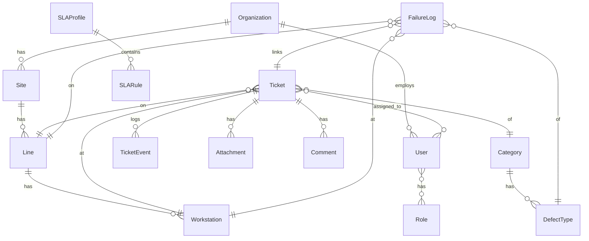

# Overview

Application for opening and managing support tickets in an electronics manufacturing environment (SMT, PTH, and cell). The goal is to reduce MTTA/MTTR, track process failures, and generate intelligence (Pareto, trends, SLA) through a dual-approval workflow (line leader and support technician).

---

## Main Roles and Permissions

- **Line Leader (LL):** opens tickets, prioritizes issues, confirms support arrival, and approves closure.
- **Process/Repair Support (SP):** accepts and handles tickets, updates statuses, records root cause and corrective actions, closes requests (pending LL approval).
- **Quality (Q):** can place lines on _quality hold_, classify defects, and link to lots/suppliers.
- **Engineering (ENG):** defines categories, severities, SLAs, and engineering actions.
- **Supervisor/Coordinator (SUP):** reassigns tickets, escalates, approves exceptions, and views global reports.
- **Admin/IT:** manages users, organizations, integrations, and master catalogs.

Suggested permissions (RBAC + scope): `ticket.create`, `ticket.assign`, `ticket.escalate`, `ticket.hold_line`, `ticket.close`, `catalog.manage`, `report.view`, `admin.*`. Optional RLS multi-tenant via `organization_id`.

---

## Ticket Flow (State Machine)

1. **OPEN** (created by LL) → queued by severity/line.
2. **ACCEPTED** (SP accepts) → marks **t0_accept**.
3. **EN_ROUTE** (optional) → technician en route.
4. **ON_SITE** (LL confirms arrival) → calculates **MTTA** (Mean Time to Acknowledge).
5. **WORKING** → issue under repair.
6. **WAITING_PARTS**/**WAITING_VENDOR**/**PAUSED** (optional states).
7. **RESOLVED_AWAITING_APPROVAL** (SP resolves issue) → LL must approve.
8. **CLOSED** (LL approves) → calculates **MTTR** (Mean Time to Resolve).
9. **CANCELLED**/**DUPLICATE** (exception states).

State transitions implemented with `django-fsm` and audited via `TicketEvent`.

---

## Automatically Measured Metrics

- **MTTA:** time between OPEN → ON_SITE.
- **MTTR:** time between OPEN → CLOSED (or ON_SITE → CLOSED).
- **SLA Compliance:** percentage within time target per severity/shift/line.
- **Total Downtime:** if _hold_line_ is active.
- **Pareto by defect category:** SPI/AOI, LCR, tombstone, bridging, missing component, etc.
- **Failures by machine/station:** Fuji NXT, Reflow, SPI Viscom, AOI, Conveyor RSO, Scanner, Wave Solder, ICT, etc.
- **Trends by shift, operator, or supplier.**

---

## Master Catalogs (Initial Fixtures)

- **Severities:** S0 (Safety), S1 (Line Down), S2 (Critical Quality), S3 (Performance), S4 (Low Priority).
- **SLA Targets:** per severity/area/shift (e.g., S1 → MTTA ≤10 min, MTTR ≤60 min).
- **Process Areas:** SMT, PTH, Rework, Test (ICT/FCT), Warehouse, Maintenance, Quality.
- **Lines & Stations:** SMT-01…, SPI, PNP, Reflow, AOI, Conveyor RSO, Scanner, Wave, Selective, etc.
- **Failure Categories (hierarchical):** Process, Machine, Materials, Method, Manpower, Measurement (5M), with IPC-A-610J subcategories.

---

## Data Model (Simplified ER)

**Key Entities:**

- `Organization(id, name)`
- `Site(id, organization_id, name)`
- `Line(id, site_id, code, name, process_type)`
- `Workstation(id, line_id, code, machine_type, asset_tag)`
- `Category(id, parent_id, name, code)`
- `DefectType(id, category_id, code, name, ipc_ref)`
- `Ticket(id, org_id, line_id, workstation_id, opened_by_id, assigned_to_id, severity, status, title, description, hold_line:boolean, created_at, accepted_at, on_site_at, resolved_at, closed_at, root_cause, containment, corrective_action, preventive_action)`
- `TicketEvent(id, ticket_id, actor_id, from_status, to_status, payload, created_at)`
- `Attachment(id, ticket_id, type, path_or_url, created_at)`
- `Comment(id, ticket_id, author_id, message, created_at)`
- `FailureLog(id, ticket_id?, line_id, workstation_id, defect_type_id, quantity, lot_id?, board_uid?, shift, occurred_at, notes)`
- `SLAProfile(id, name, org_id)` / `SLARule(id, profile_id, severity, mtta_target_min, mttr_target_min, active)`

---

## DRF Endpoints (Draft)

- `POST /api/tickets/` — create ticket (LL)
- `POST /api/tickets/{id}/accept/` — accept (SP)
- `POST /api/tickets/{id}/arrived/` — confirm arrival (LL)
- `POST /api/tickets/{id}/work/` — start work (SP)
- `POST /api/tickets/{id}/pause/`, `/resume/`
- `POST /api/tickets/{id}/resolve/` — mark resolved (SP)
- `POST /api/tickets/{id}/close/` — approve and close (LL)
- `POST /api/tickets/{id}/hold-line/` — set _quality hold_
- `POST /api/tickets/{id}/attachments/`
- `GET /api/tickets/?line=...&severity=...&status=...&mine=true`
- `GET /api/reports/pareto?period=2025-10&dimension=defect_type`
- `GET /api/reports/sla?from=2025-10-01&to=2025-10-31`
- `POST /api/failure-logs/`
- Catalogs: `GET /api/catalog/...`
- Auth/Permissions: JWT + `GET /api/me/permissions` (frontend visibility)

---

## Key Behaviors

- **Dual confirmation for MTTA:** timer starts at OPEN and stops when LL confirms ON_SITE.
- **Automatic SLA Escalation:** Celery jobs monitor MTTA/MTTR breaches and notify via Email/Teams/WhatsApp.
- **Quality Hold:** locks line, logs downtime, requires Quality release.
- **Multimedia Attachments:** photo/video/audio upload, QR/Barcode of Board UID or SAP order.
- **Offline-first mobile app:** local queue (SQLite/WatermelonDB), sync when online.
- **Notifications:** push (Expo), email, Teams/Slack; WebSocket (Django Channels) for Andon dashboard.
- **Full audit trail:** immutable `TicketEvent` logs for compliance.

---

## Future Integrations

- **MES/SAP:** link `production_order`, `lot_id`, `work_center`.
- **Viscom/SPI/AOI:** event ingestion and image correlation.
- **Active Directory/SSO:** SAML/OIDC.

---

## UX – Mobile (React Native – iPhone)

- **Home:** ticket queues by severity and line.
- **Open Ticket (LL):** select line → station → category → severity, add photos/QR, toggle “Line Down.”
- **Accept/Arrive (SP):** one-tap actions (Accept, Arrived, Start Work).
- **Resolve/Approve:** short form (root cause, actions, parts replaced), LL approves.
- **Scanner:** QR/Barcode reader for Board UID, orders, assets.
- **Pocket Andon:** live cards for each line.

---

## UX – Web (Desktop)

- **Kanban/Gantt board** of tickets by line/severity.
- **Factory Map** with real-time status (green/yellow/red).
- **Reports:** Pareto, SLA, MTTA/MTTR trends, shift heatmap.
- **Admin Catalog:** manage lines, stations, categories, severities, SLAs.

---

## Tech Stack

- **Backend:** Django + DRF, PostgreSQL, `django-fsm`, `django-filter`, `drf-spectacular`, `django-guardian` or custom RBAC, Celery + Redis, Channels (WebSocket), S3/MinIO (uploads), SimpleJWT.
- **Mobile:** React Native (Expo), camera/QR, push (Expo), offline cache (SQLite/WatermelonDB).
- **Web:** React/Next.js, shadcn/ui, WebSocket.
- **Monitoring:** Django-axes, Sentry, Prometheus/Grafana.

---

## MVP (4–6 Weeks)

1. Auth (JWT) + basic RBAC.
2. Ticket CRUD with workflow: OPEN → ACCEPTED → ON_SITE → WORKING → RESOLVED_AWAITING_APPROVAL → CLOSED.
3. Dual confirmation for arrival/closure.
4. Minimal catalog (Lines, Stations, Severity, Category).
5. Core screens: list, details, open ticket, approve ticket.
6. Metrics: MTTA/MTTR, Pareto by category; CSV export.
7. Push notifications on critical transitions.

---

## Backlog (Next Iterations)

- Quality Hold with downtime tracking.
- SLA escalation + external integrations (Teams/Email/WhatsApp API).
- Independent failure logs + correlation.
- Large file uploads (video, async upload).
- Andon dashboard (TV mode).
- SAP/MES integration.
- AI/ML suggestions for root cause and corrective actions.

---

## Security and Compliance

- Immutable audit trail via `TicketEvent`.
- Access controls per organization/site/line.
- Data retention and anonymization (GDPR/LGPD compliant).

---

## Acceptance Criteria (MVP)

- Full workflow (create → accept → arrive → resolve → approve → close) works on mobile and web.
- MTTA/MTTR auto-calculated and visible in reports.
- Ticket list with filters by line, severity, and status.
- Push notifications for critical transitions.
- CSV export for Pareto by category.

---
